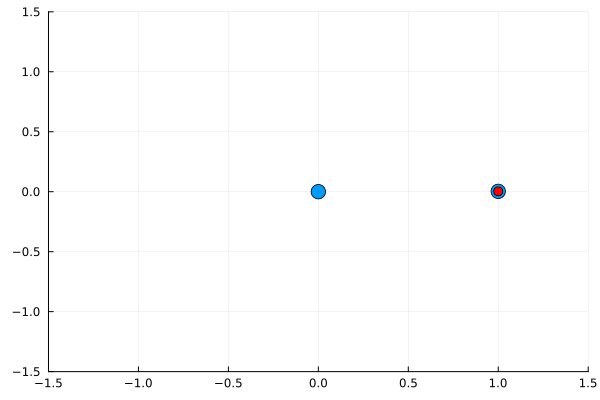

# Charged Particle Orbit Simulation ⚛️

A simple simulation of two charged particles where one particle remains stationary, and the other orbits around it under the influence of **Coulomb's Law**. The simulation uses Julia's plotting capabilities to animate the motion of the orbiting particle and visualize the circular path.

<p align="center">
  
</p>

## Table of Contents 📋
- [Overview](#overview)
- [Features](#features)
- [Installation](#installation)
- [Usage](#usage)
- [How It Works](#how-it-works)
- [Customization](#customization)
- [Contributing](#contributing)
- [License](#license)

## Overview 🧐

This project simulates two charged particles interacting via **Coulomb's Law**. One particle is fixed at the origin while the other orbits around it in a **stable circular orbit**. The orbit is driven by the balance between the electrostatic force (Coulomb force) and the centripetal force required to keep the particle on its path.

### What You Will Learn:
- How to simulate particle motion using **Coulomb's Law**.
- How to use **Euler's method** for simple numerical integration.
- How to visualize particle motion and generate animations using **Plots.jl** in Julia.

## Features 🚀

- Simulates the interaction of two charged particles under **Coulomb’s Law**.
- Produces a **GIF animation** showing the orbit of one particle around the other.
- Uses **dynamic plot updates** to visualize the circular motion.
- Simple, adjustable parameters for charge, mass, and distance.

## Installation 🛠️

1. Install Julia from the official [Julia website](https://julialang.org/downloads/).
2. Clone the repository:
   ```bash
   git clone https://github.com/yourusername/charged-particle-orbit-simulation.git
   cd charged-particle-orbit-simulation
Install the required Julia packages:
julia
Copy code
using Pkg
Pkg.add("Plots")
Pkg.add("StaticArrays")
Pkg.add("LinearAlgebra")
Usage 💻
To run the simulation and generate the orbit GIF:

Open the Julia REPL or your preferred Julia IDE.

Run the main script:

julia
Copy code
include("circular_orbit_simulation.jl")
The simulation will run, and an animated GIF (circular_orbit_fixed.gif) will be generated in the working directory.

How It Works 🔬
This simulation models the interaction of two charged particles using Coulomb’s Law:

Coulomb's Law describes the force between two charged particles:

𝐹
=
𝑘
⋅
∣
𝑞
1
⋅
𝑞
2
∣
𝑟
2
F=k⋅ 
r 
2
 
∣q 
1
​
 ⋅q 
2
​
 ∣
​
 
Where:

𝑘
k is Coulomb's constant.
𝑞
1
q 
1
​
  and 
𝑞
2
q 
2
​
  are the charges of the two particles.
𝑟
r is the distance between them.
The orbiting particle is given an initial velocity that balances this force with the centripetal force, ensuring circular motion.

The simulation uses Euler's method for numerical integration, updating the position and velocity of the orbiting particle at each time step.

Customization 🛠️
You can customize the simulation by adjusting parameters in the code:

Charge of particles (q1, q2): Modify the charge of the fixed and orbiting particles to see how different charges affect the motion.
Mass of particles (m1, m2): Change the masses of the particles to influence the acceleration.
Distance between particles (r): Adjust the initial distance between the two particles.
Time step (dt): Change the integration time step to make the simulation more accurate or faster.
Number of simulation steps (num_steps): Modify the total number of frames in the animation.
Contributing 🤝
Contributions are welcome! Feel free to submit a pull request or open an issue if you have any suggestions or find a bug.

Fork the repository.
Create your feature branch:
bash
Copy code
git checkout -b feature/AmazingFeature
Commit your changes:
bash
Copy code
git commit -m 'Add some AmazingFeature'
Push to the branch:
bash
Copy code
git push origin feature/AmazingFeature
Open a pull request.
License 📄
This project is licensed under the MIT License - see the LICENSE file for details.

Enjoy simulating! 😎 If you find this project helpful, consider giving it a ⭐ on GitHub.

markdown
Copy code

### Breakdown of the README:

1. **Overview**: A brief explanation of what the project does.
2. **Features**: Lists the cool aspects of the simulation.
3. **Installation**: Instructions on how to install Julia, clone the repo, and install dependencies.
4. **Usage**: How to run the simulation and generate the GIF.
5. **How It Works**: An explanation of the physics (Coulomb's law) and the simulation technique (Euler's method).
6. **Customization**: Details on how to modify the simulation parameters.
7. **Contributing**: Guidelines for contributing to the project.
8. **License**: MIT license reference.

Make sure to customize the links (like `yourusername`) and file paths to your own repository if you're uploading this to GitHub! Let me know if you'd like to tweak anything further! 😊


